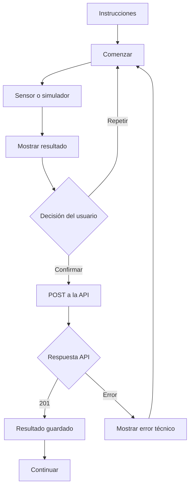

# Contrato API v1.2 — Versión para estudiantes

**Proyecto:** Tótem de triaje preventivo  
**Versión:** 1.2 — contrato simplificado actualizado  
**Destinatarios:** estudiantes con conocimientos básicos de Python  
**Tecnologías:** Python, FastAPI, SQLModel, SQLite, Pytest, Swagger/OpenAPI, Jinja2, HTML, CSS y JavaScript básico  
**Fecha:** 6 de septiembre de 2026

> Este documento fija el estándar común para integrar los seis módulos y el frontend. No es un manual clínico y no contiene diagnósticos ni umbrales clínicos inventados.

## 1. Objetivo del contrato

Los seis grupos desarrollan módulos diferentes:

1. Signos vitales.
2. ECG.
3. Glucemia.
4. Boca.
5. Vista.
6. Oído.

Cada grupo desarrolla cuatro dimensiones de su módulo:

- investigación clínica y técnica;
- backend/API;
- frontend del módulo;
- pruebas automáticas.

Además, cada grupo tiene una tarea transversal que contribuye al sistema común.

## 2. Estado actual del repositorio base

La base entregada ya incluye:

- aplicación FastAPI ejecutable;
- conexión y sesiones SQLModel con SQLite;
- creación automática de tablas;
- modelos comunes `Paciente`, `EpisodioAtencion`, `Dispositivo` y `ResultadoModulo`;
- servicio común para guardar y consultar resultados;
- endpoints básicos de pacientes;
- endpoints básicos de episodios;
- alta y consulta de dispositivos (`POST` y `GET`);
- módulo `demo_ambiente` como ejemplo;
- Swagger/OpenAPI;
- pruebas iniciales con Pytest.

Los estudiantes **no deben reconstruir desde cero** estos componentes. Deben comprenderlos, probarlos y ampliarlos únicamente cuando su ficha de grupo lo indique.

## 3. Contrato común de resultados

Todos los módulos envían:

```json
{
  "episodio_id": 15,
  "dispositivo_id": 4,
  "origen": "SIMULADOR",
  "data": {}
}
```

Los campos `episodio_id`, `dispositivo_id` y `origen` son comunes. El objeto `data` cambia según el módulo.

| Campo | Tipo | Obligatorio | Descripción |
|---|---|---:|---|
| `episodio_id` | entero | Sí | Episodio de atención activo |
| `dispositivo_id` | entero | Sí | Dispositivo o simulador utilizado |
| `origen` | texto | Sí | `SENSOR` o `SIMULADOR` |
| `data` | objeto JSON | Sí | Datos específicos del módulo |

No se envían desde el módulo: paciente, fecha/hora del servidor, nombre del módulo, clasificación clínica ni diagnóstico.

### 3.1. Cómo se obtiene `dispositivo_id`

`dispositivo_id` **no es un número fijo asignado a cada grupo**. SQLite genera ese identificador cuando el dispositivo se registra. La identidad estable del dispositivo es su campo `codigo`.

El repositorio base ya entrega estos endpoints:

```text
POST /api/v1/dispositivos
GET  /api/v1/dispositivos
GET  /api/v1/dispositivos/{dispositivo_id}
```

Para registrar un dispositivo ficticio durante el desarrollo:

```json
{
  "codigo": "ECG-001",
  "nombre": "Electrocardiógrafo ficticio",
  "tipo": "ECG"
}
```

La API devuelve el `id` generado, junto con `estado`, `activo` y `creado_en`. Ese `id` es el que se utiliza luego como `dispositivo_id` al guardar resultados. Si el dispositivo ya existe, se utiliza `GET /api/v1/dispositivos` para localizarlo por `codigo` y recuperar su `id`.

Códigos sugeridos para las pruebas educativas:

| Grupo | Código sugerido | Tipo |
|---:|---|---|
| 1 | `SV-001` | `SIGNOS_VITALES` |
| 2 | `ECG-001` | `ECG` |
| 3 | `GLU-001` | `GLUCEMIA` |
| 4 | `BOCA-001` | `BOCA` |
| 5 | `VISTA-001` | `VISTA` |
| 6 | `OIDO-001` | `OIDO` |

Estos códigos identifican al dispositivo; **no equivalen al ID de la base**. El paciente no debe escribir `dispositivo_id` manualmente en el frontend final. La interfaz debe obtenerlo desde la API o desde la configuración acordada para el módulo.

## 4. Persistencia común

Los seis módulos utilizan `ResultadoModulo`:

| Campo | Función |
|---|---|
| `id` | identificador generado por la base |
| `episodio_id` | episodio relacionado |
| `dispositivo_id` | dispositivo utilizado |
| `modulo` | nombre interno del módulo |
| `data_json` | JSON serializado con datos específicos |
| `fecha_hora` | fecha/hora generada por el servidor |

Los grupos no crean una tabla distinta para cada medición. Las nuevas tablas necesarias para **consentimiento, clasificación o informes** solo podrán incorporarse en la tarea transversal correspondiente y sin modificar unilateralmente los cuatro modelos comunes entregados.

## 5. Endpoints existentes en la base

| Estado | Método | Ruta | Función |
|---|---|---|---|
| Implementado | GET | `/health` | Verificar la API |
| Implementado | POST | `/api/v1/pacientes` | Crear paciente ficticio |
| Implementado | GET | `/api/v1/pacientes` | Listar pacientes |
| Implementado | GET | `/api/v1/pacientes/{paciente_id}` | Consultar paciente por ID |
| Implementado | POST | `/api/v1/episodios` | Crear episodio |
| Implementado | GET | `/api/v1/episodios` | Listar episodios |
| Implementado | GET | `/api/v1/episodios/{episodio_id}` | Consultar episodio |
| Implementado | POST | `/api/v1/dispositivos` | Registrar dispositivo |
| Implementado | GET | `/api/v1/dispositivos` | Listar dispositivos |
| Implementado | GET | `/api/v1/dispositivos/{dispositivo_id}` | Consultar dispositivo |
| Implementado | POST | `/api/v1/demo-ambiente/resultados` | Guardar resultado demo |
| Implementado | GET | `/api/v1/demo-ambiente/resultados` | Listar resultados demo |
| Implementado | GET | `/api/v1/demo-ambiente/resultados/{episodio_id}` | Consultar demo por episodio |

## 6. Endpoints de los seis módulos

### Guardar resultado

| Grupo | Ruta |
|---|---|
| Signos vitales | `POST /api/v1/signos-vitales/resultados` |
| ECG | `POST /api/v1/ecg/resultados` |
| Glucemia | `POST /api/v1/glucemia/resultados` |
| Boca | `POST /api/v1/boca/resultados` |
| Vista | `POST /api/v1/vista/resultados` |
| Oído | `POST /api/v1/oido/resultados` |

### Consultar resultados de un episodio

| Grupo | Ruta |
|---|---|
| Signos vitales | `GET /api/v1/signos-vitales/resultados/{episodio_id}` |
| ECG | `GET /api/v1/ecg/resultados/{episodio_id}` |
| Glucemia | `GET /api/v1/glucemia/resultados/{episodio_id}` |
| Boca | `GET /api/v1/boca/resultados/{episodio_id}` |
| Vista | `GET /api/v1/vista/resultados/{episodio_id}` |
| Oído | `GET /api/v1/oido/resultados/{episodio_id}` |

## 7. Distribución transversal

| Grupo | Responsabilidad transversal | Frontend transversal |
|---:|---|---|
| 1 | Identificación y registro del paciente | Inicio, búsqueda por DNI y registro |
| 2 | Episodios, selección de circuito y estados | Selección de circuito y episodio activo |
| 3 | Consentimiento y control de continuidad del episodio | Consentimiento y habilitación/bloqueo del recorrido |
| 4 | Frontend base común y navegación | `base.html`, estilos comunes, panel del episodio |
| 5 | Motor de reglas y clasificación por semáforo | Pantalla de clasificación |
| 6 | Informe final e integración E2E | Resumen final, informe y cierre |

## 8. Endpoints transversales previstos

| Responsable | Método | Ruta | Estado |
|---|---|---|---|
| Grupo 1 | GET | `/api/v1/pacientes/dni/{dni}` | A desarrollar |
| Grupo 2 | POST | `/api/v1/episodios/{episodio_id}/estado` | A desarrollar |
| Grupo 3 | POST | `/api/v1/consentimientos` | A desarrollar |
| Grupo 3 | GET | `/api/v1/consentimientos/{episodio_id}` | A desarrollar |
| Grupo 5 | POST | `/api/v1/episodios/{episodio_id}/clasificar` | A desarrollar |
| Grupo 5 | GET | `/api/v1/episodios/{episodio_id}/clasificacion` | A desarrollar |
| Grupo 6 | POST | `/api/v1/episodios/{episodio_id}/informes` | A desarrollar |
| Grupo 6 | GET | `/api/v1/episodios/{episodio_id}/informes` | A desarrollar |

El alta y consulta de dispositivos forman parte de la infraestructura común ya entregada. Ningún grupo debe reprogramar esos endpoints. El Grupo 4 no necesita crear un endpoint transversal propio: su responsabilidad es integrar visualmente los endpoints existentes mediante el frontend base.

## 9. Contrato frontend ↔ API

El frontend se implementa con Jinja2, HTML, CSS y JavaScript básico.

### Flujo común



Reglas comunes:

- El frontend no guarda directamente en SQLite.
- El frontend no modifica el valor medido.
- El `POST` ocurre solo después de **Confirmar**.
- El botón **Repetir** descarta la captura no confirmada.
- El frontend debe conservar el `episodio_id` activo durante el recorrido.
- Los errores `404`, `409` y `422` deben mostrarse de manera comprensible.
- La clasificación y el informe consumen datos persistidos, nunca valores que estén solo en pantalla.

### Archivos frontend sugeridos

```text
app/templates/
├── base.html
├── inicio.html
├── paciente.html
├── circuito.html
├── consentimiento.html
├── episodio.html
├── clasificacion.html
├── resumen.html
└── modulos/
    ├── signos_vitales.html
    ├── ecg.html
    ├── glucemia.html
    ├── boca.html
    ├── vista.html
    └── oido.html

app/static/
├── css/
│   └── estilos.css
└── js/
    ├── app.js
    ├── signos_vitales.js
    ├── ecg.js
    ├── glucemia.js
    ├── boca.js
    ├── vista.js
    └── oido.js
```

## 10. Datos de ejemplo por módulo

> Los valores de `dispositivo_id` de los ejemplos son ilustrativos. Cada instalación debe utilizar el ID que SQLite haya generado para el dispositivo registrado en esa base de datos.

### Signos vitales

```json
{
  "episodio_id": 15,
  "dispositivo_id": 1,
  "origen": "SIMULADOR",
  "data": {
    "presion_sistolica": 118,
    "presion_diastolica": 76,
    "frecuencia_cardiaca": 74,
    "temperatura": 36.5,
    "saturacion_oxigeno": 98
  }
}
```

### ECG

```json
{
  "episodio_id": 15,
  "dispositivo_id": 2,
  "origen": "SIMULADOR",
  "data": {
    "frecuencia_muestreo_hz": 250,
    "muestras": [0.02, 0.08, 0.31, 0.12, -0.04],
    "unidad": "mV"
  }
}
```

### Glucemia

```json
{
  "episodio_id": 15,
  "dispositivo_id": 3,
  "origen": "SIMULADOR",
  "data": {
    "valor": 123.4,
    "unidad": "mg/dL",
    "metodo": "SIMULADO"
  }
}
```

### Boca

```json
{
  "episodio_id": 15,
  "dispositivo_id": 4,
  "origen": "SIMULADOR",
  "data": {
    "nombre_imagen": "boca_demo_01.jpg",
    "observacion_tecnica": "Imagen ficticia enfocada"
  }
}
```

### Vista

```json
{
  "episodio_id": 15,
  "dispositivo_id": 5,
  "origen": "SIMULADOR",
  "data": {
    "prueba": "PRUEBA_DEMO",
    "ojo_derecho": "RESULTADO_DEMO_D",
    "ojo_izquierdo": "RESULTADO_DEMO_I",
    "distancia_cm": 300
  }
}
```

### Oído

```json
{
  "episodio_id": 15,
  "dispositivo_id": 6,
  "origen": "SIMULADOR",
  "data": {
    "frecuencias_hz": [500, 1000, 2000],
    "resultados_oido_derecho": [true, true, false],
    "resultados_oido_izquierdo": [true, false, false]
  }
}
```

## 11. Respuestas y códigos HTTP

| Código | Uso |
|---:|---|
| `200` | consulta correcta |
| `201` | recurso o resultado creado |
| `404` | recurso relacionado inexistente |
| `409` | conflicto, por ejemplo DNI o código de dispositivo duplicado |
| `422` | dato faltante o tipo inválido |
| `500` | error inesperado |

## 12. Investigación clínica y reglas

Cada grupo investiga las especificaciones clínicas de su propio módulo. La investigación, la fuente oficial, la regla candidata, las diferencias entre documentos, la revisión profesional, la implementación técnica y el estado de activación se documentan exclusivamente mediante `FICHA_TRAZABILIDAD_REGLA_CLINICA.md`.

Las fichas de grupo describen el **foco de investigación** y las tareas técnicas, pero no duplican el procedimiento de validación clínica.

Las fuentes autorizadas son exclusivamente OMS, Ministerio de Salud de la Nación y Ministerio de Salud de la Provincia de Córdoba. El software no puede inventar umbrales. Si las fuentes oficiales difieren, la diferencia se registra en la ficha clínica y se remite al profesional responsable. Una regla nueva requiere la revisión y el estado de activación definidos en `FICHA_TRAZABILIDAD_REGLA_CLINICA.md` antes de habilitarse.

## 13. Pruebas mínimas

Cada módulo debe probar:

1. solicitud válida;
2. campo obligatorio faltante;
3. tipo incorrecto;
4. episodio inexistente;
5. persistencia y consulta;
6. interacción frontend **Comenzar → Resultado → Confirmar/Repetir**;
7. manejo de error de API;
8. pruebas propias de la tarea transversal asignada.

El Grupo 6 coordina las pruebas E2E, pero cada grupo corrige los defectos de su propio módulo.

## 14. Elementos que no deben modificarse sin autorización

- `database.py` y configuración SQLite;
- modelos comunes `Paciente`, `EpisodioAtencion`, `Dispositivo` y `ResultadoModulo`;
- servicio compartido de persistencia;
- rutas y schemas de otros grupos;
- umbrales o fuentes de reglas clínicas aprobadas;
- resultados históricos.

El Grupo 4 puede modificar los archivos frontend comunes asignados. Los grupos 3, 5 y 6 pueden crear modelos auxiliares para consentimiento, clasificación e informes únicamente dentro de su responsabilidad transversal y con revisión docente.

## 15. Criterio de cumplimiento

Un grupo cumple el contrato cuando entrega investigación clínica trazable, backend funcional, frontend de su módulo, persistencia, pruebas, y la responsabilidad transversal asignada sin romper los contratos comunes.
