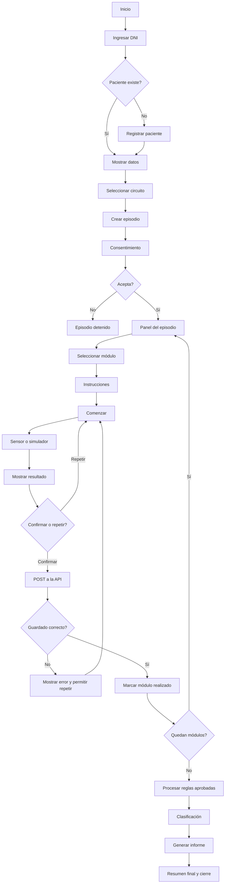
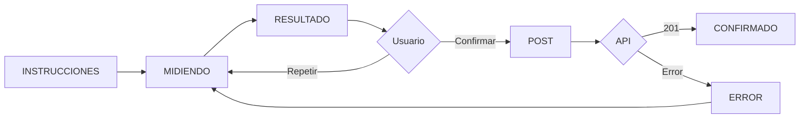
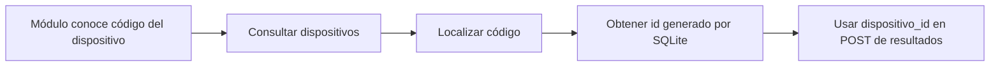

# Frontend base y flujo — Tótem de triaje preventivo

**Versión:** 1.0  
**Fecha:** 6 de septiembre de 2026

## 1. Objetivo

El frontend será desarrollado por los estudiantes. Se utilizará una única aplicación FastAPI con Jinja2, HTML, CSS y JavaScript básico. Cada grupo construye la pantalla de su propio módulo y además participa en una parte transversal de la interfaz.

## 2. Arquitectura

```text
Navegador
   ↓
Jinja2 / HTML / CSS / JavaScript
   ↓ fetch()
FastAPI
   ↓
SQLModel
   ↓
SQLite
```

El navegador nunca accede directamente a SQLite.

## 3. Flujograma general



## 4. Flujo estándar de cada módulo



## 5. Estructura sugerida

```text
app/templates/
├── base.html
├── inicio.html
├── paciente.html
├── circuito.html
├── consentimiento.html
├── episodio.html
├── clasificacion.html
├── resumen.html
└── modulos/
    ├── signos_vitales.html
    ├── ecg.html
    ├── glucemia.html
    ├── boca.html
    ├── vista.html
    └── oido.html

app/static/
├── css/
│   └── estilos.css
└── js/
    ├── app.js
    ├── signos_vitales.js
    ├── ecg.js
    ├── glucemia.js
    ├── boca.js
    ├── vista.js
    └── oido.js
```

## 6. Distribución frontend

| Grupo | Pantalla de módulo | Responsabilidad frontend transversal |
|---:|---|---|
| 1 | Signos vitales | Inicio, identificación por DNI y registro |
| 2 | ECG | Selección de circuito y episodio activo |
| 3 | Glucemia | Consentimiento y habilitación/bloqueo del recorrido |
| 4 | Boca | `base.html`, navegación, estilos comunes y panel del episodio |
| 5 | Vista | Pantalla de clasificación por semáforo |
| 6 | Oído | Resumen final, informe y cierre del episodio |

## 7. Reglas de integración visual

- Grupo 4 define la plantilla base y clases CSS comunes.
- Cada grupo utiliza esas clases antes de agregar estilos propios.
- Cada grupo mantiene su JavaScript en un archivo específico de módulo.
- No se cambian nombres de IDs, rutas ni campos de otro grupo sin Pull Request y revisión.
- La pantalla nunca muestra un diagnóstico.
- Las advertencias rojas representan prioridad/derivación según protocolo aprobado, no diagnóstico.
- Los errores técnicos se distinguen de los resultados de medición.

## 8. Estado del panel del episodio

El panel debe indicar, como mínimo:

```text
Paciente: Juan Pérez
Episodio: #12
Circuito: COMPLETO

Signos vitales     REALIZADO
ECG                PENDIENTE
Glucemia           PENDIENTE
Boca               PENDIENTE
Vista              PENDIENTE
Oído               PENDIENTE
```

No debe inferir estados clínicos a partir de colores del frontend antes de que exista una clasificación persistida.

## 9. Interacción con la API

Ejemplo conceptual de JavaScript:

```javascript
const respuesta = await fetch('/api/v1/ecg/resultados', {
  method: 'POST',
  headers: {'Content-Type': 'application/json'},
  body: JSON.stringify(datos)
});
```

La interfaz debe revisar `respuesta.ok` antes de mostrar “guardado correctamente”.

## 9.1. Uso de dispositivos desde el frontend

El alta y consulta de dispositivos ya están resueltas por la infraestructura común. El frontend del paciente **no debe pedir que escriba un `dispositivo_id`**.

Cada módulo trabaja con un `codigo` estable de dispositivo. Cuando necesite enviar un resultado, debe utilizar el `id` real registrado en la base. Ese ID puede obtenerse previamente desde `GET /api/v1/dispositivos` o mediante la configuración acordada para el módulo.

Flujo conceptual:



Los estudiantes usan `POST /api/v1/dispositivos` para cargar su dispositivo ficticio durante la preparación del entorno, pero no deben modificar ni reimplementar ese endpoint.

## 10. Criterios de aceptación

- recorrido completo navegable sin utilizar Swagger como interfaz de usuario;
- cada módulo implementa los cinco estados visuales;
- Confirmar realiza el POST y Repetir no guarda;
- errores de API quedan visibles y recuperables;
- el episodio activo se mantiene entre pantallas;
- clasificación e informe leen información persistida;
- las seis pantallas de módulo mantienen una identidad visual común;
- no se presentan diagnósticos.
